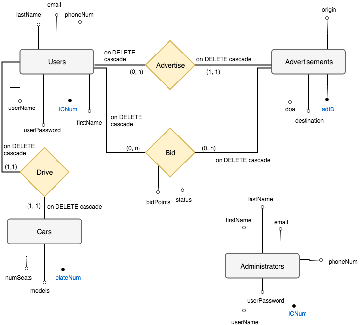

## Table of Contents

[TOC]

<div style="page-break-after: always;"></div>

## 1 Introduction

This project requires us to build a car pooling web-application. This application allows car drivers to advertise opportunities for car pooling and passengers to search for car rides. A car ride advertisement specifies an origin to a destination on a certain date and a given time. Both users and cars have a profile. Drivers advertise rides and passengers bid for the rides. Users acan play both roles of drivers and passengers. The successful bidder for an advertised ride would be chosen by the car driver. Each user has an account, and administrators can create, modify and delete entries.

### 1.1 Specifications

In this project, the design of CarPooling application would require three main components, namely the database design, database server and webpage. The database design includes the *database schema* and *ER diagram* which will dictate the structure of the database. The database server implemented is *PostgreSQL* and the webpage is hosted on *Apache* locally. We also use *PHP*, *HTML*, *CSS* and *JavaScript* as our front-end and back-end programming language.


## 2 Database Design

### 2.1 Entity-Relationship Diagram





### 2.2 Database Schema

```sql
CREATE TABLE Cars(
	plateNum VARCHAR(16) PRIMARY KEY,
	models VARCHAR(64) NOT NULL,
	numSeats INTEGER NOT NULL,
	CONSTRAINT numSeats CHECK (numSeats>0));
   
CREATE TABLE Drive(
	plateNum VARCHAR(16),
	ICNum VARCHAR(16),
	PRIMARY KEY(plateNum, ICNum),
            FOREIGN KEY(plateNum) REFERENCES Cars(plateNum) ON DELETE CASCADE,
    	FOREIGN KEY(ICNum) REFERENCES Users(ICNum) ON DELETE CASCADE);
    
CREATE TABLE Users(
    userName VARCHAR(16) UNIQUE NOT NULL,
    userPassword VARCHAR(16) NOT NULL,
    ICNum VARCHAR(16) PRIMARY KEY,
    firstName VARCHAR(64) NOT NULL,
    lastName VARCHAR(64) NOT NULL,
    email VARCHAR(64) UNIQUE NOT NULL,
    phoneNum INTEGER NOT NULL);
    
CREATE TABLE Advertisements(
    adID SERIAL PRIMARY KEY,
    origin VARCHAR(64) NOT NULL,
    destination VARCHAR(64) NOT NULL,
    doa TIMESTAMP NOT NULL);
    
CREATE TABLE Advertise(
	ICNum VARCHAR(16),
	adID INTEGER,
	PRIMARY KEY(ICNum, adID),
	FOREIGN KEY(ICNum) REFERENCES Users(ICNum) ON DELETE CASCADE,
	FOREIGN KEY(adID) REFERENCES Advertisements(adID) ON DELETE CASCADE);

CREATE TABLE Bid(
	ICNum VARCHAR(16),
	adID INTEGER,
            bidPoints INTEGER DEFAULT 0,
	PRIMARY KEY(ICNum, adid),
	FOREIGN KEY(ICNum) REFERENCES Users(ICNum) ON DELETE CASCADE,
	FOREIGN KEY(adID) REFERENCES Advertisements(adID) ON DELETE CASCADE);

ALTER TABLE bid
ADD COLUMN status varchar(64);
ALTER TABLE ONLY bid ALTER COLUMN status SET DEFAULT 'Not Selected';

ALTER TABLE bid 
ADD CONSTRAINT bid_status_check CHECK (status in ('Not Selected', 'Selected'));

CREATE TABLE Administrators(
    userName VARCHAR(16) UNIQUE NOT NULL,
    userPassword VARCHAR(16) NOT NULL,
    ICNum VARCHAR(16) PRIMARY KEY,
    firstName VARCHAR(64) NOT NULL,
    lastName VARCHAR(64) NOT NULL,
    email VARCHAR(64) UNIQUE NOT NULL,
    phoneNum INTEGER NOT NULL);
    
```

### 2.3 Schema Functions

The *users* entity stores user information such as username, password, IC number, name etc. A *user* can have two different roles, namely *driver* and *passenger*.  A *driver* can add a car to indicate ownership, post car ride advertisements and select successful bidders. A *passenger* can browse through all the posts to bid for a ride. An *administrator* is able to access information of all users, and meanwhile has his/her own information stored.

The *advertisement* entity stores information about each ride, which includes its ID, an origin, a destination and a specific date. The *car* entity contains information about respective drivers' car(s), such as plate number, models and number of seats in this car.

The *drive* relationship models the relation between drivers and cars. The *advertise* relationship models the relation between users, more specifically drivers and the car ride advertisements. The *bid* relationship models the relation between users and advertisements, and stores the information of bid points added by users, as well as the status between advertisements and respective users.

Furthermore, several non-trivial **constraints** are implemented. The first is that *users* cannot bid for multiple *advertisements* whose origin and destination are different, and time difference between them is within 15 minutes. The second is that *drivers* cannot select multiple *bidders* with different origin & destination and similar pick-up time (within 15 minutes). In addition, *drivers* cannot select a *bidder* who is already been selected by other *drivers*. This is done by showing *advertisements* that are   not yet selected in `Select Bidder` page. Lastly, in `Bid Ad` page, advertisements that are bidded by *user* and already selected by *driver* are not shown for the *user* him/herself.


## 3 SQL Queries

### 3.1 Simple Queries

* SELECT

  We omit some of the simple SELECT queries due to words limit, such as login and simple information retrieving. They can be reviewed in the source code provided.

  ```sql
  -- Retrieve bidding status of advertisements the specific user has posted
  -- (meaning all those he/she can select), thus the bid should also not yet be selected by other drivers
  SELECT b.adid, b.icnum as BidderIC, a.origin, a.destination, a.doa, at.icnum, bidpoints, status
  FROM bid b, advertisements a, advertise at
  WHERE status = 'Not Selected' AND b.adid = a.adid AND b.adid = at.adid AND at.icnum = '$_SESSION[icnum]'
  ORDER BY b.adid;

  -- Find ads eligible to bid, also show the user's bidpoint and the current max bidpoint
  SELECT * ,
  	(SELECT max(bidpoints) AS maxBid FROM bid GROUP BY adid HAVING adid = a.adid),
  	(SELECT bidpoints AS yourBid FROM bid WHERE icnum='$_SESSION[icnum]' AND adid = a.adid)
  FROM advertisements a
  WHERE NOT EXISTS (
  	SELECT 1 FROM bid b
  	WHERE b.adid = a.adid
      AND icnum = '$_SESSION[icnum]'
  	AND b.status = 'Selected');

  -- Get all cars of the current user
  SELECT *
  FROM cars
  WHERE plateNum IN (
  	SELECT plateNum FROM drive WHERE icnum = '$_SESSION[icnum]'
  );

  -- Get all advertisements posted by the current user;
  SELECT DISTINCT uaa.adid, uaa.origin, uaa.destination, uaa.doa
  FROM ((users u natural left join advertise a ) natural join advertisements) as uaa
  WHERE uaa.icnum = '$_SESSION[icnum]';

  -- Get all ads that the user have bidded, show also the status whether he/she is selected
  SELECT origin, destination, doa, bidpoints, status, u.lastname, u.firstname
  FROM bid, advertisements a, users u
  WHERE bid.adid = a.adid
  AND driveric = u.icnum
  AND bid.icnum = '$_SESSION[icnum]'
  ```

* INSERT

  ```sql
  -- User sign up
  INSERT INTO users (username, userpassword, icnum, firstname, lastname, email, phonenum)
  	VALUES ('$_POST[username]', '$_POST[userpassword]', '$_POST[icnum]', '$_POST[firstname]', '$_POST[lastname]', '$_POST[email]', '$_POST[phonenum]');
  	
  -- Admin sign up
  INSERT INTO administrators (username, userpassword, icnum, firstname, lastname, email, phonenum)
  	VALUES ('$_POST[username]', '$_POST[userpassword]', '$_POST[icnum]', '$_POST[firstname]', '$_POST[lastname]', '$_POST[email]', '$_POST[phonenum]');

  -- Post an advertisement (Insert into advertisement and also advertise in one transection)
  BEGIN;
  INSERT INTO advertisements (origin, destination, doa) VALUES ('$_POST[origin]', '$_POST[destination]', '$_POST[doa]');
  INSERT INTO advertise (icnum, adid)(
  	SELECT '$_SESSION[icnum]', adid
  	FROM advertisements
  	ORDER BY adid
  	DESC LIMIT 1
  );
  END;

  -- Bidding an advertisement
  -- Step 1: Check whether the user has already bidded for that specific advertisements
  SELECT * FROM bid WHERE adid = $_POST[adid] AND icnum = '$_SESSION[icnum]';
  -- Step 2:
  -- IF not exists a record
  INSERT INTO bid VALUES ('$_SESSION[icnum]', $_POST[adid], '$_POST[bidpoints]';
  -- ELSE update points the existing one
  UPDATE bid
  SET bidpoints = '$_POST[bidpoints]'
  WHERE icnum = '$_SESSION[icnum]'
  AND adid = '$_POST[adid]';

  -- Apply to be a driver;
  BEGIN;
  INSERT INTO cars (platenum, models, numseats) VALUES ('$_POST[platenum]', '$_POST[models]', '$_POST[numseats]');
  INSERT INTO drive(platenum, icnum) VALUES ('$_POST[platenum]', '$_SESSION[icnum]');
  END;
  ```

* DELETE

  ```sql
  -- Delete a user according to the icnum
  DELETE FROM users WHERE icnum = '$_POST[icnum]';
  DELETE FROM drive WHERE plateNum = '$_POST[platenum]' and icnum='$_POST[icnum]';
  DELETE FROM cars WHERE plateNum='$_POST[platenum]';
  ```

* UPDATE

  ```sql
  -- When a driver selects a bidder, set the bid status to 'SELECTED'.
  UPDATE bid
  	SET status = 'Selected'
  	WHERE icnum = '$_POST[icnum]'
  	AND adid = '$_POST[adid]';
  ```

* Functions and Others

  ```sql
  ------------- FUNCTIONS -------------
  -- Update bid points
  CREATE OR REPLACE FUNCTION incBid(IC VARCHAR, ad INTEGER, val NUMERIC)
  RETURNS BOOLEAN AS
  'BEGIN
  UPDATE bid
  SET bidPoints=bidPoints+val
  WHERE ICNUM=IC and adID=ad;
  RETURN TRUE;
  END;'
  LANGUAGE PLPGSQL;

  -- Update bid status
  CREATE OR REPLACE FUNCTION selBidder(IC VARCHAR, ad INTEGER)
  RETURNS BOOLEAN AS $$
  BEGIN
  UPDATE bid
  SET status='Selected', driverIC=IC
  WHERE adid=ad;
  IF ((SELECT driveric FROM bid WHERE adid = ad) = IC) --Check whether the update is successful
  THEN RETURN TRUE;
  ELSE
  RETURN NULL;
  END; $$
  LANGUAGE PLPGSQL;

  ------------- LOG -------------
  CREATE TABLE blog (
  	ICNum VARCHAR(16),
  	adID INTEGER,
  	pointBefore INTEGER,
  	pointAfter INTEGER NOT NULL,
  	upadteTime TIMESTAMP NOT NULL
  );

  CREATE OR REPLACE FUNCTION bidlog()
  RETURNS TRIGGER AS $$
  DECLARE pb INTEGER;
  DECLARE now TIMESTAMP;
  BEGIN
  now := CURRENT_TIMESTAMP;
  IF TG_OP ='INSERT'
  THEN pb:=null;
  ELSEIF TG_OP ='UPDATE'
  THEN pb:=OLD.bidpoints;
  END IF;
  INSERT INTO blog
  VALUES (NEW.icnum, NEW.adID, pb, NEW.bidpoints, now);
  RETURN NULL;
  END; $$
  LANGUAGE PLPGSQL;

  CREATE TRIGGER logBP
  AFTER INSERT OR UPDATE
  ON bid
  FOR EACH ROW
  EXECUTE PROCEDURE bidlog();
  ```

###3.2 Complex Queries

```sql
-- For displaying maximum bidpoint of each advertisement. This is to be viewed by administrator.
SELECT DISTINCT *
FROM (
		SELECT adid, max(bidpoints) as points
		FROM bid
		GROUP BY adid
) AS combined natural join advertisements
ORDER BY points DESC;

-- Show all expired ads (14 days), with its max bidpoint, in descending time order
SELECT DISTINCT *
FROM (
		SELECT adid, max(bidpoints) as points
		FROM bid
		GROUP BY adid
) AS combined natural join advertisements
WHERE CURRENT_TIMESTAMP - doa > '14 day'::interval
ORDER by doa DESC;

-- Top 10 popular ad of the week
SELECT DISTINCT *
FROM (
		SELECT adid, max(bidpoints) as points
		FROM bid
		GROUP BY adid
) AS combined natural join advertisements
WHERE CURRENT_TIMESTAMP - doa <= '7 day'::interval
ORDER BY points DESC
LIMIT 10;
```


## 4 Implementation of Non-Trivial Integrity Constraint

In this project, the non-trivial integrity constraint is that *bidPoints* must be **positive**. To keep *bidPoints* > 0, we include the following functions and triggers:

```sql
-- Function and trigger to keep integrity constraint (bidpoint > 0)
CREATE OR REPLACE FUNCTION exception()
RETURNS TRIGGER AS $$
BEGIN
RAISE NOTICE 'invalid bidpoint';
RETURN NULL;
END; $$
LANGUAGE PLPGSQL;

CREATE TRIGGER exception
BEFORE INSERT OR UPDATE
ON bid
FOR EACH STATEMENT
WHEN NEW.bidpoint < 0
EXECUTE PROCEDURE exception();
```

Moreover, as mentioned above, we need to ensure that *drivers* cannot select *bidders* with different origin & destination and same time (within 15 minutes), and similarly, *bidders* cannot bid for multiple *advertisements* with different origin & destination and same time (within 15 minutes). To implement these constraints, we have:

```sql
-- Prohibit driver from selecting multiple bids if the driver would not be able to pick up the next driver on time. (Timeframe set to be 15 mins)
CREATE OR REPLACE FUNCTION checkDriverTime()
RETURNS TRIGGER AS $$
DECLARE t TIMESTAMP;
DECLARE ori VARCHAR(64);
DECLARE dest VARCHAR(64);
BEGIN
t := (SELECT doa FROM Advertisements WHERE adid = NEW.adid);
ori := (SELECT origin FROM Advertisements WHERE adid = NEW.adid);
dest := (SELECT destination FROM Advertisements WHERE adid = NEW.adid);
IF (SELECT count(*) FROM Bid NATURAL JOIN Advertisements
		WHERE driverIC = NEW.driveric
		AND origin <> ori
		AND destination <> dest
		AND ((t - doa < '15 minute'::interval AND t - doa >'-15 minute'::interval)
			OR
			(doa - t < '15 minute'::interval AND doa - t >'-15 minute'::interval))
		)
THEN
RAISE NOTICE 'Select bidder failed on checkDriverTime()!';
RETURN NULL;
ELSE
RAISE NOTICE 'Select bidder success!';
RETURN NEW;
END IF;
END; $$
LANGUAGE PLPGSQL;

CREATE TRIGGER driverTime
BEFORE UPDATE
ON bid
FOR EACH ROW
WHEN (NEW.status = 'Selected')
EXECUTE PROCEDURE checkDriverTime();

-- Prohibit user from bidding multiple bids of different routes in the same 15 minutes timeframe (Rationale being they cannot change ride in such a short timeframe)
CREATE OR REPLACE FUNCTION checkBidderTime()
RETURNS TRIGGER AS $$
DECLARE t TIMESTAMP;
DECLARE ori VARCHAR(64);
DECLARE dest VARCHAR(64);
BEGIN
t := (SELECT doa FROM Advertisements WHERE adid = NEW.adid);
ori := (SELECT origin FROM Advertisements WHERE adid = NEW.adid);
dest := (SELECT destination FROM Advertisements WHERE adid = NEW.adid);

IF EXISTS(SELECT 1 FROM Bid NATURAL JOIN Advertisements
		WHERE icnum = NEW.icnum
		AND origin <> ori
		AND destination <> dest
		AND ((t - doa < '15 minute'::interval AND t - doa >'-15 minute'::interval)
				OR
				(doa - t < '15 minute'::interval AND doa - t >'-15 minute'::interval))
		)
THEN
RAISE NOTICE 'Create bid failed on checkBidderTime()!';
RETURN NULL;
ELSE
RAISE NOTICE 'Create bid success!';
RETURN NEW;
END IF;
END; $$
LANGUAGE PLPGSQL;


CREATE TRIGGER bidderTime
BEFORE INSERT
ON bid
FOR EACH ROW
EXECUTE PROCEDURE checkBidderTime();


-- delete trigger
CREATE OR REPLACE FUNCTION delete()
RETURNS TRIGGER AS $$
BEGIN
RAISE NOTICE 'An user is deleted';
RETURN NULL;
END; $$
LANGUAGE PLPGSQL;

CREATE TRIGGER deleteTrigger
BEFORE DELETE
ON users
FOR EACH STATEMENT
EXECUTE PROCEDURE delete();

-- update trigger
CREATE OR REPLACE FUNCTION update()
RETURNS TRIGGER AS $$
BEGIN
RAISE NOTICE 'Bid status is updated';
RETURN NULL;
END; $$
LANGUAGE PLPGSQL;

CREATE TRIGGER updateTrigger
BEFORE UPDATE
ON bid
FOR EACH STATEMENT
EXECUTE PROCEDURE update();

-- insert car trigger
CREATE OR REPLACE FUNCTION insertCars()
RETURNS TRIGGER AS $$
BEGIN
RAISE NOTICE 'A car is inserted into database';
RETURN NULL;
END; $$
LANGUAGE PLPGSQL;

CREATE TRIGGER insertCarsTrigger
BEFORE UPDATE
ON cars
FOR EACH STATEMENT
EXECUTE PROCEDURE insertCars();

-- insert drive trigger
CREATE OR REPLACE FUNCTION insertDrive()
RETURNS TRIGGER AS $$
BEGIN
RAISE NOTICE 'A driver is added';
RETURN NULL;
END; $$
LANGUAGE PLPGSQL;

CREATE TRIGGER insertDriveTrigger
BEFORE UPDATE
ON drive
FOR EACH STATEMENT
EXECUTE PROCEDURE insertDrive();
```


## 5 Web Interface Design

<p>


<em><center>*Sign Up Page*</center></em>


<em><center>*Sign In Page*</center></em>


<em><center>*Overview of Web Page*</center></em>


<em><center>*Post an Advertisement*</center></em>


<em><center>*Apply Driver Page*</center></em>


<em><center>*Bid Advertisements Page*</center></em>


<em><center>*Select Bidders Page*</center></em>


<em><center>*Homepage Overview with Cars, Advertisements and Bids infomation*</center></em>


</p>

